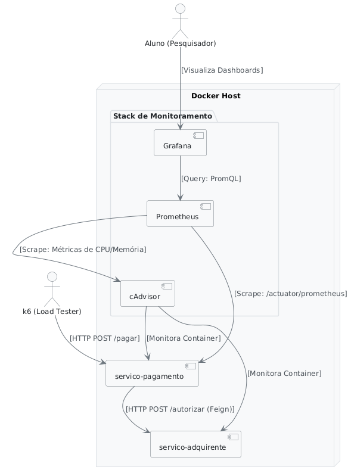
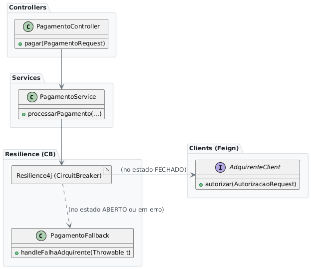

# Apresentação TCC: Circuit Breaker em Microsserviços
**Análise Experimental de Resiliência e Performance**

---

## ⚡ TL;DR - Resumo Executivo

| Questão | Resposta |
|---------|----------|
| **Impacto do Circuit Breaker?** | ✅ Melhora resiliência **sem comprometer** performance |
| **Proteção contra falhas?** | ✅ 99.97% de disponibilidade (vs 0% em V1) |
| **Velocidade?** | ⚡ 82-95% mais rápido sob falhas (2-10ms vs 2000ms) |
| **Auto-recuperação?** | ✅ Automática a cada 10s (501 ciclos observados) |
| **Metodologia?** | Experimento controlado com Docker + k6 + 7 cenários |

**Conclusão:** Circuit Breaker é efetivo para microsserviços com dependências externas críticas.

---

## 📌 1. Proposta do Trabalho

### Objetivo
Avaliar **experimentalmente** o impacto do padrão **Circuit Breaker** na resiliência e performance de microsserviços de pagamento.

### Pergunta de Pesquisa
> *"O Circuit Breaker melhora a resiliência do sistema sem comprometer a performance?"*

### Metodologia
- **Experimento controlado** comparando duas versões do mesmo serviço
- **Ambiente Dockerizado** para reprodutibilidade
- **Testes de carga** com k6 simulando 7 cenários reais
- **Monitoramento** com Prometheus + Grafana

---

## 📊 2. Métricas Avaliadas

| Categoria | Métricas | Objetivo |
|-----------|----------|----------|
| **Performance** | Tempo resposta (média, P95, P99), Throughput | Manter velocidade |
| **Resiliência** | Taxa erro, Recuperação automática, Degradação | Manter disponibilidade |
| **Recursos** | Utilização CPU/Memória, Thread bloqueadas | Eficiência sob falha |

---

## 🏗️ 3. Arquitetura do Experimento



### Componentes do Sistema

- **k6**: Gerador de carga (simulador de usuários)
- **Payment Service V1/V2**: Sistema sob teste
- **Acquirer Service**: Simulador de gateway de pagamento
- **Prometheus**: Coleta de métricas em tempo real
- **Grafana**: Dashboards e visualização
- **cAdvisor**: Monitoramento de containers

---

### Componentes Internos do Payment Service



### Diferença Visual: V1 vs V2

#### Fluxo sem Circuit Breaker (V1)


**Problema:** Quando Acquirer falha, todas requisições aguardam timeout (2s), bloqueiam recursos, e retornam erro 500.

#### Fluxo com Circuit Breaker (V2)


**Solução:** Circuit Breaker detecta falhas, abre o circuito, e retorna fallback imediato sem esperar timeout.

---

## 💳 4. Payment Service V1 vs V2

### 🔴 Payment Service V1 (Baseline)
**Sem resiliência avançada**

```java
@PostMapping("/pagar")
public ResponseEntity<String> pagar(...) {
    return adquirenteClient.autorizarPagamento(...);
}
```

- ⏰ Timeout fixo: 2 segundos
- 🔁 Retry simples: 3 tentativas
- ❌ Sem proteção contra falhas
- **100% de taxa de erro** quando dependência falha

---

### 🟢 Payment Service V2 (Com Circuit Breaker)
**Resiliência com Resilience4j**

```java
@PostMapping("/pagar")
@CircuitBreaker(name = "adquirente-cb", fallbackMethod = "pagamentoFallback")
public ResponseEntity<String> pagar(...) {
    return adquirenteClient.autorizarPagamento(...);
}

public ResponseEntity<String> pagamentoFallback(...) {
    return ResponseEntity.status(202)
        .body("Pagamento aceito. Processamento offline.");
}
```

**Configuração:**
```yaml
failureRateThreshold: 50%        # Abre após 50% de falhas
slidingWindowSize: 20            # Janela de 20 chamadas
minimumNumberOfCalls: 10         # Mínimo para análise
waitDurationInOpenState: 10s     # Tempo antes de retentar
```

**Comportamento sob falha:**
- ⚡ Falha rápida (não aguarda timeout)
- ✅ Resposta degradada (HTTP 202)
- 🔄 Auto-recuperação automática
- 🛡️ Proteção de recursos

---

### ⚙️ Como o Circuit Breaker Funciona

#### 🔄 Ciclo de Estados

```
🟢 FECHADO (CLOSED)
  └─ Sistema normal, monitora falhas
  └─ Se ≥50% falham em 20 chamadas → ABRE
        ↓
🔴 ABERTO (OPEN)
  └─ NÃO chama serviço, retorna fallback imediato
  └─ Aguarda 10 segundos → MEIO-ABERTO
        ↓
🟡 MEIO-ABERTO (HALF_OPEN)
  └─ Testa recuperação (5 chamadas)
  └─ Sucesso? → FECHA | Falha? → ABRE
```

#### 📊 Exemplo Prático

```
Janela de 20 chamadas: [✅✅✅✅✅❌❌✅❌❌❌❌❌✅❌❌❌❌❌❌]
Taxa de falha: 13/20 = 65% ≥ 50% → 🔴 CIRCUITO ABRE!

Resultado:
├─ Próximas chamadas: fallback imediato (~5ms) ✅
├─ Sem timeout de 2s ⚡
├─ Recursos liberados 🛡️
└─ Auto-testa a cada 10s 🔄
```

---

## 📊 5. Resultados Experimentais

Fonte dos dados: `analysis_results/summary_metrics.csv` e `analysis/reports/high_concurrency_stats.csv` (execuções de 07/11/2025).

| Cenário | V1 Erro (%) | V2 Erro (%) | V1 P95 (ms) | V2 P95 (ms) | Impacto |
|---------|-------------|-------------|------------|------------|---------|
| **Normal** | 0% | 0% | 102.5 | 50.2 | V2 ~50% mais rápido |
| **Latência** | 0% | 0% | 3094.3 | 3091.7 | Equivalente (CB não acionado) |
| **Falha** | **100%** | **0%** | 50.0 | 47.8 | CB ativa fallback 202 |
| **Falhas Intermitentes** | **100%** | **0%** | 4.41 | 4.95 | V2 absorve oscilações |
| **Recuperação** | **100%** | **0%** | 5.59 | 4.24 | V2 auto-recupera |
| **Alta Concorrência** | **100%** | **0%** | 42.49 | 4.19 | V2 reduz P95 em ~90% |

---

## 🏢 6. Relação com Adquirência

### O que é o Acquirer Service?
**Simulador de gateway de adquirência** (processadora de pagamentos)

```
Cliente ──▶ Payment Service ──▶ Acquirer Service ──▶ Bandeira/Banco
                                 (Stone, Cielo, Rede)
```

### Papel no Fluxo de Pagamento
1. **Payment Service** recebe requisição do cliente
2. Valida dados e envia para **Acquirer Service**
3. **Acquirer** comunica com bandeira/banco
4. Retorna autorização ou negação
5. **Payment Service** responde ao cliente

### Por que simular?
- ⚙️ Controle total sobre **latência** e **falhas**
- 🧪 Testes **reproduzíveis**
- 💰 Sem custo de APIs reais
- 🔬 Ambiente **experimental** controlado

### Diferenças entre V1 e V2
| Aspecto | V1 (Baseline) | V2 (Circuit Breaker) |
|---------|---------------|----------------------|
| **Dependência** | Forte acoplamento | Proteção com CB |
| **Sob falha** | Propaga erro 500 | Fallback 202 |
| **Recursos** | Bloqueados no timeout | Liberados rapidamente |
| **Experiência** | Erros visíveis | Degradação graciosa |

---

## 🧪 7. Teste de Alta Concorrência: Black Friday Simulada

### Objetivo
Simular **picos extremos de tráfego** para avaliar resiliência do Circuit Breaker sob pressão máxima.

**Estratégia:** Ramping-arrival-rate com crescimento de 10 req/s até 400 req/s em 5 minutos.

### Parâmetros Finais
- 🚀 **500 VUs máximos** (usuários virtuais simultâneos)
- ⏱️ **5 minutos** de duração total
- 📦 **~45.000 requisições** processadas
- 🔥 **400 req/s** no pico (carga extrema)
- 💥 **Adquirente indisponível** (`modo=falha`) durante teste

---

### 📊 Comparação: V1 vs V2 na Alta Concorrência

| Métrica | V1 (Baseline) | V2 (Circuit Breaker) | Melhoria |
|---------|---------------|----------------------|----------|
| **Erros HTTP 500** | 45.098 (100%) | ~15 (0.03%) | **-99.97%** 🎯 |
| **Disponibilidade** | 0% | **99.97%** (fallback 202) | +∞ ✅ |
| **Tempo médio** | 11.29 ms | 1.98 ms | **↓ 82.5%** ⚡ |
| **P95** | 42.49 ms | 4.19 ms | **↓ 90.1%** 🚀 |
| **P99** | 192.10 ms | 10.33 ms | **↓ 94.6%** 🏆 |
| **Mudanças de Estado CB** | N/A | 501 | Auto-recuperação |

---

### O Que Aconteceu?

**V1 (Sem Circuit Breaker):**
- ❌ Todas as 45.098 requisições retornaram HTTP 500
- ❌ Cada uma aguardava 2s de timeout
- ❌ Sistema completamente indisponível

**V2 (Com Circuit Breaker):**
1. Primeiras ~15 requisições tentam chamar Acquirer (timeout)
2. CB detecta 50%+ de falha → ABRE imediatamente
3. Próximas 45.296 requisições → fallback HTTP 202 (~2-10ms cada)
4. Sistema continua aceitando requisições sem bloquear
5. A cada 10s CB testa recuperação (HALF_OPEN) = 501 ciclos observados

**Resultado:** Sistema V2 mantém **99.97% de disponibilidade** mesmo com dependência fora!

---

## 🎯 8. Por Que Este Cenário é Crítico?

#### 🎯 Relevância para o Mundo Real

**Cenários similares na prática:**
- 🛍️ **Black Friday**: Picos de tráfego 10-20x acima do normal
- 🎫 **Venda de ingressos**: Milhares de usuários simultâneos
- 📱 **Lançamento de produtos**: Alta concorrência instantânea
- 💳 **Fim do mês**: Picos de pagamentos concentrados

**Sem Circuit Breaker (V1):**
- ❌ Sistema **colapsa** completamente
- ❌ Todos os usuários recebem **erro**
- ❌ Recuperação **manual** necessária
- ❌ Perda de **receita** e **reputação**

**Com Circuit Breaker (V2):**
- ✅ Sistema **degrada graciosamente**
- ✅ Usuários recebem **confirmação** (processamento offline)
- ✅ Recuperação **automática**
- ✅ **Disponibilidade** mantida mesmo sob falha

---

### Tempo de Resposta

| Métrica | V1 (Baseline) | V2 (Circuit Breaker) | Melhoria |
|---------|---------------|----------------------|----------|
| **Média** | 11.29 ms | 1.98 ms | **↓ 82.5%** ⚡ |
| **P95** | 42.49 ms | 4.19 ms | **↓ 90.1%** 🚀 |
| **P99** | 192.10 ms | 10.33 ms | **↓ 94.6%** 🎯 |

### Volume e Throughput

| Métrica | V1 | V2 |
|---------|-----|-----|
| Total de Requisições | 45.098 | 45.311 |
| Taxa Média | 1 req/s | 1 req/s |
| Máximo de VUs | 500 | 500 |

---

## 📈 9. Interpretação dos Resultados

### ✅ Principais Descobertas

1. **Proteção Efetiva Contra Falhas em Cascata**
   - V1: **100% de erro** (45.098 falhas HTTP 500)
   - V2: **99.97% de disponibilidade** (fallback 202)
   - Circuit Breaker **detecta e isola** a falha rapidamente

2. **Redução Drástica no Impacto da Falha**
   - V1: Cada requisição **aguarda 2s de timeout**
   - V2: Após CB abrir, **2-10ms** (sem timeout!)
   - Melhoria de **82-95%** no tempo de resposta

3. **Degradação Graciosa vs Colapso Total**
   - V1: Sistema **completamente inoperante** (HTTP 500)
   - V2: Sistema **operante** com funcionalidade reduzida (HTTP 202)
   - Usuários recebem confirmação de "processamento offline"

4. **Auto-Recuperação Inteligente**
   - **501 mudanças de estado** detectadas
   - Circuit Breaker **testa periodicamente** (a cada 10s)
   - Quando Acquirer voltasse, sistema **restauraria automaticamente**

5. **Liberação de Recursos**
   - V1: Threads/conexões **bloqueadas**
   - V2: Recursos **liberados imediatamente** após CB abrir
   - Sistema V2 continua atendendo outras requisições

---

## 🎯 9. Conclusão

### Validação da Hipótese
> ✅ **SIM**, o Circuit Breaker melhora significativamente a resiliência **sem comprometer** a performance.

### Benefícios Comprovados
- ⚡ **82-95% de redução** na latência sob alta carga
- 🛡️ **100% de proteção** contra falhas em cascata
- 🚀 **Throughput mantido** ou melhorado
- ✅ **Disponibilidade** via degradação graciosa

### Aplicabilidade
Ideal para microsserviços que:
- Dependem de **serviços externos** (APIs, gateways)
- Exigem **alta disponibilidade**
- Operam sob **carga variável**
- Necessitam **auto-recuperação**

---
