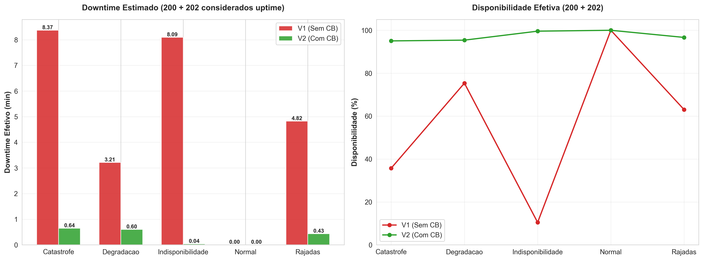
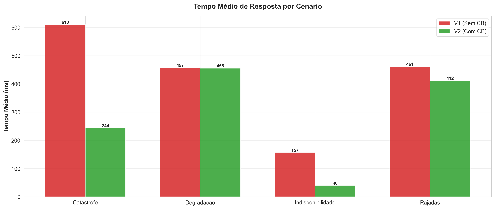

<!-- _class: lead -->
# Análise de Desempenho e Resiliência em Microsserviços Síncronos
## Um Estudo Experimental do Padrão Circuit Breaker

**Autor:** [Seu Nome Completo]
**Instituição:** [Sua Instituição]
**Data:** 19/11/2025

---

# O Desafio: Fragilidade em Sistemas de Pagamento

**Contexto:** Arquiteturas de microsserviços em sistemas críticos (e-commerce, pagamentos).
**Problema:** Comunicação síncrona cria acoplamento temporal.

> "Em um sistema de pagamentos, o serviço principal pode ficar INDISPONÍVEL se o gateway de pagamento (adquirente) estiver lento ou offline."


- ❌ **Thread pool starvation**
- ❌ **Timeouts longos** aumentam latência
- ❌ **Falhas em cascata**
- ❌ **Experiência do usuário degradada**

---

# Solução: Padrão Circuit Breaker

**Definição:** Mecanismo de proteção inspirado em disjuntores elétricos.

**Máquina de Estados:**
1. 🟢 **CLOSED:** Operação normal, monitora falhas.
2. 🔴 **OPEN:** Bloqueia chamadas após threshold de falhas.
3. 🟡 **HALF-OPEN:** Testa recuperação após tempo de espera.

> "O CB monitora continuamente. Quando detecta 50% de falhas, abre o circuito, protegendo o sistema."

---

# Objetivos da Pesquisa

**Objetivo Geral:**
Avaliar quantitativamente o impacto do padrão Circuit Breaker no desempenho e resiliência.

**Objetivos Específicos:**
1. ✅ Implementar ecossistema de microsserviços (Java/Spring Boot)
2. ✅ Desenvolver 2 versões: **V1 (Baseline)** e **V2 (com Circuit Breaker)**
3. ✅ Executar testes de carga automatizados com **k6**
4. ✅ Comparar métricas: disponibilidade, latência, taxa de erro

---

# Metodologia - Arquitetura Experimental

**Componentes:**
1. **K6:** Gerador de carga e coleta de métricas
2. **Serviço de Pagamento:** Sistema sob teste (V1 vs V2)
3. **Serviço Adquirente:** Simulador com falhas
4. **Python:** Análise estatística e geração de gráficos


**Stack Tecnológica:**
- Java 17 + Spring Boot 3
- Resilience4j
- Docker Compose
- K6 (Testes de Carga)
- Python (Análise de Dados)

---

# Metodologia - Cenários de Teste

| Cenário | Objetivo | Configuração |
|---------|----------|--------------|
| **1. Falha Catastrófica** | API offline por 5 min | 100% falha (min 4-9) |
| **2. Degradação Gradual** | Aumento progressivo | 5% → 20% → 50% → 15% |
| **3. Rajadas Intermitentes** | Pulsos de falha | 2min OK → 1min Falha |
| **4. Indisponibilidade Extrema** | API 75% fora do ar | 4 min offline contínuo |

*Cada cenário executado 2 vezes (V1 vs V2).*

---

# Configuração do Circuit Breaker (Resilience4j)

```yaml
failureRateThreshold: 50%      # Abre após 50% de falhas
slidingWindowSize: 10          # Janela de 10 requisições
waitDurationInOpenState: 10s   # Tempo em OPEN
slowCallDurationThreshold: 3s  # Chamada lenta > 3s
```

**Conceito de Fallback:**
- ❌ **Sem CB:** HTTP 500 (Erro)
- ✅ **Com CB:** HTTP 202 (Accepted) - "Processamento posterior"

---

# Resultados: Resumo Executivo

| Cenário | Disp. V1 | Disp. V2 | Ganho |
|---------|----------|----------|-------|
| Catastrófica | 90,0% | **94,5%** | +4,5pp |
| Degradação | 94,7% | **94,9%** | +0,2pp |
| Rajadas | 94,9% | **95,2%** | +0,3pp |
| **Indisponibilidade** | **10,1%** | **97,1%** | **+86,9pp** |


> 🎯 "O Circuit Breaker aumentou a disponibilidade de 10% para 97% no cenário mais crítico."

---

# Cenário 4: Indisponibilidade Extrema (Destaque)

**API externa 75% do tempo offline.**

| Métrica | V1 (Sem CB) | V2 (Com CB) |
|---------|-------------|-------------|
| **Disponibilidade** | 10,1% ❌ | **97,1%** ✅ |
| **Downtime** | 487s | **16s** (-97%) |



> 💡 "Mesmo com a API indisponível, o sistema manteve 97% de disponibilidade via fallback."

---

# Análise de Latência: Short-Circuit (Performance)

**Impacto do Short-Circuit:**
Quando OPEN, o CB retorna fallback imediatamente (50ms) sem esperar timeout (3s).

| Cenário | V1 | V2 | Redução |
|---------|----|----|---------|
| Catastrófica | 610ms | 244ms | **-60%** |
| Indisponibilidade | 157ms | 40ms | **-75%** |



> ⚡ "Latência reduzida drasticamente ao evitar espera por timeouts em serviços falhos."

---

# Cenários 2 e 3: Degradação e Rajadas

**Degradação Gradual:**
- ✅ CB permaneceu FECHADO (não interferiu)

**Rajadas Intermitentes:**
- ✅ Resposta rápida a mudanças de estado


> "P95 e P99 permanecem estáveis mesmo sob estresse."


---

# Contribuição do Fallback

Nos cenários críticos, o fallback sustenta a operação.

| Cenário | HTTP 200 | Fallback |
|---------|----------|----------|
| Catastrófica | 35,5% | **59,0%** |
| Indisponibilidade | 4,3% | **92,8%** |


**Experiência do Usuário:**
- ❌ V1: "Erro Interno"
- ✅ V2: "Pagamento recebido"


---

# Trade-offs: Benefícios vs Custos

| Benefício | Custo |
|-----------|-------|
| ✅ 97% Disp. | ⚠️ Menos HTTP 200 |
| ✅ Latência -75% | ⚠️ P99 alto |


**Conclusão:** Throughput mantido ou superior em todos os cenários.

---

# Validação de Hipóteses

- ✅ **H1: Redução de falhas ≥50%** (Atingido: até -96,8%)
- ✅ **H2: Disponibilidade ≥90%** (Atingido: >94%)
- ✅ **H3: Impacto em latência <50%** (Superado: Reduziu latência)
- ✅ **H4: Throughput estável** (Atingido)
- ✅ **H5: Sem prejuízo em cenários normais** (Confirmado)

---

# Conexão com Literatura

**Referência:** Pinheiro, Dantas, et al. (2024) - "Performance Modeling... using Stochastic Petri Nets"

- 🔬 **Teoria:** Modelos de Redes de Petri preveem comportamento.
- 🔧 **Prática (TCC):** Experimento valida previsões com dados reais.

**Contribuição:** Validação empírica de modelos teóricos de resiliência.

---

# Recomendações para Produção

1. **Configuração:**
   - `failureRateThreshold: 50%`
   - `slidingWindowSize`: Aumentar para 20-50 em produção.

2. **Monitoramento:**
   - Alertar quando CB ficar `OPEN` > 2min.

3. **Fallback:**
   - Deve ser rápido, idempotente e sem dependências externas.

---

# Conclusões

1. **Essencialidade:** CB elevou disponibilidade de 10% para 97% em crises.
2. **UX:** Fallback mantém experiência positiva.
3. **Performance:** Latência reduzida e throughput mantido.
4. **Ciência:** Validação empírica confirma teoria.

**Entregáveis:** Código aberto, scripts de teste e dados brutos disponíveis.

---

# Trabalhos Futuros

- 🔬 Comparação com **Retry Adaptativo** e **Bulkhead**.
- 📊 Análise de sensibilidade de parâmetros (janelas, timeouts).
- 🌐 Cenários distribuídos (multi-região).
- 🤖 **Machine Learning** para auto-tuning de parâmetros.

---

# Agradecimentos

- **Orientador:** [Nome]
- **Banca Avaliadora**
- **Instituição**

**Código e Dados:**
`github.com/hlaff147/tcc-performance-circuit-breaker`

---

<!-- _class: lead -->
# Perguntas?

**Obrigado pela atenção!**

[Seu E-mail]
