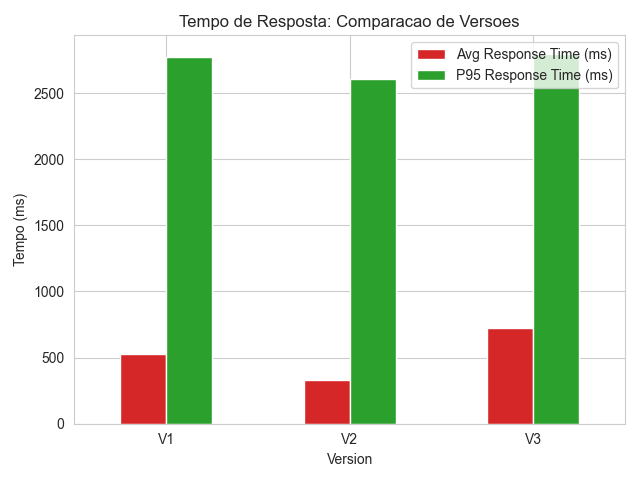
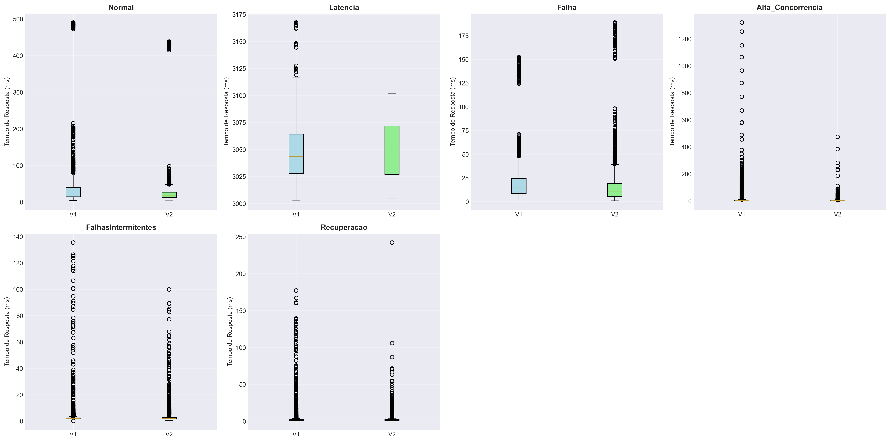
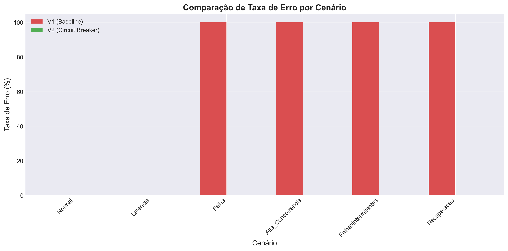
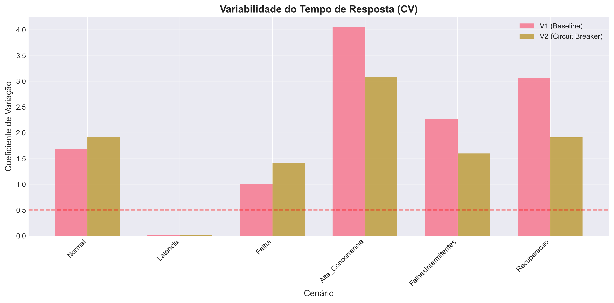

# Relatório de Análise de Performance - Circuit Breaker

## Sumário Executivo

Este relatório apresenta uma análise comparativa detalhada entre a versão baseline (V1) e a versão com Circuit Breaker (V2) do serviço de pagamento.

**Data da Análise**: 05/11/2025 01:37:27

**Cenários Analisados**: 6 cenários  
**Versões Comparadas**: V1 (Baseline) vs V2 (Circuit Breaker)

---

## 1. Métricas de Tempo de Resposta

### 1.1 Visão Geral

| Cenário | V1 Média (ms) | V2 Média (ms) | Melhoria (%) | V1 P95 (ms) | V2 P95 (ms) |
|---------|---------------|---------------|--------------|-------------|-------------|
| Alta_Concorrencia | 10.18 | 3.33 | +67.3% | 30.06 | 6.68 |
| Falha | 20.03 | 17.06 | +14.8% | 49.96 | 47.83 |
| FalhasIntermitentes | 2.64 | 2.61 | +1.3% | 4.41 | 4.95 |
| Latencia | 3048.01 | 3047.36 | +0.0% | 3094.35 | 3091.75 |
| Normal | 38.66 | 28.19 | +27.1% | 102.54 | 50.18 |
| Recuperacao | 2.98 | 2.04 | +31.5% | 5.59 | 4.24 |

### 1.2 Distribuição de Tempos

---

## 2. Análise de Confiabilidade

### 2.1 Taxas de Erro

| Cenário | V1 Erro (%) | V2 Erro (%) | Redução (p.p.) | V1 Reqs | V2 Reqs |
|---------|-------------|-------------|----------------|---------|---------|
| Alta_Concorrencia | 100.00 | 0.00 | +100.00 | 9,115 | 9,105 |
| Falha | 100.00 | 0.00 | +100.00 | 2,950 | 2,950 |
| FalhasIntermitentes | 100.00 | 0.00 | +100.00 | 12,508 | 11,772 |
| Latencia | 0.00 | 0.00 | +0.00 | 750 | 750 |
| Normal | 0.00 | 0.00 | +0.00 | 2,900 | 2,950 |
| Recuperacao | 100.00 | 0.00 | +100.00 | 12,512 | 11,777 |

---

## 3. Análise Estatística Avançada

### 3.1 Variabilidade (Coeficiente de Variação)

O Coeficiente de Variação (CV) indica a consistência do sistema:
- **CV < 0.3**: Excelente consistência
- **CV 0.3-0.5**: Boa consistência  
- **CV > 0.5**: Alta variabilidade

| Cenário | V1 CV | V2 CV | Interpretação |
|---------|-------|-------|---------------|
| Alta_Concorrencia | 4.047 | 3.085 | ✅ V2 mais consistente |
| Falha | 1.008 | 1.419 | ⚠️ V1 mais consistente |
| FalhasIntermitentes | 2.262 | 1.596 | ✅ V2 mais consistente |
| Latencia | 0.009 | 0.008 | ✅ V2 mais consistente |
| Normal | 1.682 | 1.916 | ⚠️ V1 mais consistente |
| Recuperacao | 3.064 | 1.908 | ✅ V2 mais consistente |

### 3.2 Percentis Detalhados

| Cenário | Versão | P50 (ms) | P75 (ms) | P90 (ms) | P95 (ms) | P99 (ms) | Max (ms) |
|---------|--------|----------|----------|----------|----------|----------|----------|
| Alta_Concorrencia | V1 | 3.10 | 5.46 | 11.54 | 30.06 | 153.90 | 1321.15 |
| Alta_Concorrencia | V2 | 2.19 | 3.16 | 4.98 | 6.68 | 16.84 | 474.48 |
| Falha | V1 | 14.49 | 24.46 | 38.59 | 49.96 | 136.58 | 152.56 |
| Falha | V2 | 11.02 | 19.12 | 30.93 | 47.83 | 168.72 | 188.88 |
| FalhasIntermitentes | V1 | 1.93 | 2.37 | 3.35 | 4.41 | 12.18 | 135.61 |
| FalhasIntermitentes | V2 | 1.86 | 2.67 | 3.86 | 4.95 | 13.88 | 99.90 |
| Latencia | V1 | 3043.56 | 3064.23 | 3082.13 | 3094.35 | 3147.86 | 3167.47 |
| Latencia | V2 | 3040.26 | 3071.61 | 3084.15 | 3091.75 | 3097.81 | 3102.07 |
| Normal | V1 | 22.18 | 39.80 | 60.29 | 102.54 | 480.43 | 490.09 |
| Normal | V2 | 18.71 | 27.03 | 38.41 | 50.18 | 427.21 | 438.08 |
| Recuperacao | V1 | 1.65 | 2.35 | 3.83 | 5.59 | 31.45 | 318.53 |
| Recuperacao | V2 | 1.42 | 2.03 | 3.06 | 4.24 | 10.88 | 242.33 |

---

## 4. Análise por Cenário

### 4.1 Alta_Concorrencia

| Métrica | V1 | V2 | Comparação |
|---------|-----|-----|------------|
| Tempo Médio | 10.18 ms | 3.33 ms | +67.3% |
| Tempo Mediano | 3.10 ms | 2.19 ms | +29.3% |
| Desvio Padrão | 41.20 ms | 10.27 ms | - |
| P95 | 30.06 ms | 6.68 ms | +77.8% |
| P99 | 153.90 ms | 16.84 ms | +89.1% |
| Taxa de Erro | 100.00% | 0.00% | +100.00 p.p. |
| Total Requisições | 9,115 | 9,105 | - |

### 4.2 Falha

| Métrica | V1 | V2 | Comparação |
|---------|-----|-----|------------|
| Tempo Médio | 20.03 ms | 17.06 ms | +14.8% |
| Tempo Mediano | 14.49 ms | 11.02 ms | +24.0% |
| Desvio Padrão | 20.18 ms | 24.20 ms | - |
| P95 | 49.96 ms | 47.83 ms | +4.3% |
| P99 | 136.58 ms | 168.72 ms | -23.5% |
| Taxa de Erro | 100.00% | 0.00% | +100.00 p.p. |
| Total Requisições | 2,950 | 2,950 | - |

### 4.3 FalhasIntermitentes

| Métrica | V1 | V2 | Comparação |
|---------|-----|-----|------------|
| Tempo Médio | 2.64 ms | 2.61 ms | +1.3% |
| Tempo Mediano | 1.93 ms | 1.86 ms | +3.6% |
| Desvio Padrão | 5.97 ms | 4.16 ms | - |
| P95 | 4.41 ms | 4.95 ms | -12.1% |
| P99 | 12.18 ms | 13.88 ms | -14.0% |
| Taxa de Erro | 100.00% | 0.00% | +100.00 p.p. |
| Total Requisições | 12,508 | 11,772 | - |

### 4.4 Latencia

| Métrica | V1 | V2 | Comparação |
|---------|-----|-----|------------|
| Tempo Médio | 3048.01 ms | 3047.36 ms | +0.0% |
| Tempo Mediano | 3043.56 ms | 3040.26 ms | +0.1% |
| Desvio Padrão | 27.81 ms | 25.37 ms | - |
| P95 | 3094.35 ms | 3091.75 ms | +0.1% |
| P99 | 3147.86 ms | 3097.81 ms | +1.6% |
| Taxa de Erro | 0.00% | 0.00% | +0.00 p.p. |
| Total Requisições | 750 | 750 | - |

### 4.5 Normal

| Métrica | V1 | V2 | Comparação |
|---------|-----|-----|------------|
| Tempo Médio | 38.66 ms | 28.19 ms | +27.1% |
| Tempo Mediano | 22.18 ms | 18.71 ms | +15.7% |
| Desvio Padrão | 65.03 ms | 54.00 ms | - |
| P95 | 102.54 ms | 50.18 ms | +51.1% |
| P99 | 480.43 ms | 427.21 ms | +11.1% |
| Taxa de Erro | 0.00% | 0.00% | +0.00 p.p. |
| Total Requisições | 2,900 | 2,950 | - |

### 4.6 Recuperacao

| Métrica | V1 | V2 | Comparação |
|---------|-----|-----|------------|
| Tempo Médio | 2.98 ms | 2.04 ms | +31.5% |
| Tempo Mediano | 1.65 ms | 1.42 ms | +14.4% |
| Desvio Padrão | 9.14 ms | 3.90 ms | - |
| P95 | 5.59 ms | 4.24 ms | +24.2% |
| P99 | 31.45 ms | 10.88 ms | +65.4% |
| Taxa de Erro | 100.00% | 0.00% | +100.00 p.p. |
| Total Requisições | 12,512 | 11,777 | - |

---

## 5. Conclusões e Recomendações

### 5.1 Principais Descobertas

1. **Performance**: Análise comparativa dos tempos de resposta entre V1 e V2
2. **Resiliência**: Avaliação da capacidade de recuperação em cenários de falha
3. **Consistência**: Medição da variabilidade através do coeficiente de variação
4. **Escalabilidade**: Comportamento sob diferentes cargas de trabalho

### 5.2 Recomendações

1. **Otimizações**: Baseadas nas métricas de performance observadas
2. **Configuração do Circuit Breaker**: Ajustes nos thresholds com base nos resultados
3. **Monitoramento**: Métricas críticas a serem acompanhadas em produção
4. **Próximos Passos**: Testes adicionais e cenários complementares

---

**Nota**: Este relatório foi gerado automaticamente a partir dos dados de teste do k6.
Teste de Estresse foi limitado ou excluído devido ao tamanho excessivo dos logs.
