```mermaid
flowchart TB
    subgraph LoadGen["🔥 Load Generation"]
        K6["K6 Load Generator<br/>(Up to 200 VUs)"]
    end

    subgraph Services["☕ Spring Boot Microservices"]
        subgraph Versions["Payment Service Versions"]
            V1["V1: Baseline<br/>(Timeout Only)"]
            V2["V2: Circuit Breaker<br/>(Resilience4j CB)"]
            V3["V3: Retry<br/>(Exponential Backoff)"]
            V4["V4: Composition<br/>(Retry + CB)"]
        end
        Acquirer["Acquirer Service<br/>(Failure Simulator)"]
    end

    subgraph Observability["📊 Observability & Analysis"]
        Prom[("Prometheus<br/>Metrics Store")]
        Python["Python Analytics<br/>(Scientific Analysis)"]
        Outputs["📄 Academic Outputs<br/>(LaTeX, PNG, CSV)"]
    end

    K6 --> V1 & V2 & V3 & V4

    V1 -->|"Feign"| Acquirer
    V2 -->|"Feign + CB"| Acquirer
    V3 -->|"Feign + Retry"| Acquirer
    V4 -->|"Feign + Retry + CB"| Acquirer

    V1 & V2 & V3 & V4 -.->|"metrics"| Prom
    Prom --> Python --> Outputs

    style V1 fill:#FFCDD2,stroke:#D32F2F
    style V2 fill:#C8E6C9,stroke:#388E3C
    style V3 fill:#BBDEFB,stroke:#1976D2
    style V4 fill:#FFE0B2,stroke:#F57C00
    style K6 fill:#FF9800,stroke:#E65100,color:#fff
    style Prom fill:#9C27B0,stroke:#6A1B9A,color:#fff
    style Python fill:#FFEB3B,stroke:#FBC02D
    style Outputs fill:#4CAF50,stroke:#2E7D32,color:#fff
```

## Legend

| Version | Strategy | Behavior |
|---------|----------|----------|
| V1 | Timeout Only | Fails on dependency issues |
| V2 | Circuit Breaker | Fail-fast with fallback (HTTP 202) |
| V3 | Retry | Exponential backoff (3 attempts) |
| V4 | Retry + CB | Absorbs jitters, then fail-fast |

## Simulated Scenarios
- **Catastrophe**: 100% failure (5min)
- **Bursts**: Intermittent outages
- **Degradation**: Gradual latency increase
- **Unavailability**: 75% error rate
- **Normal**: Baseline comparison
