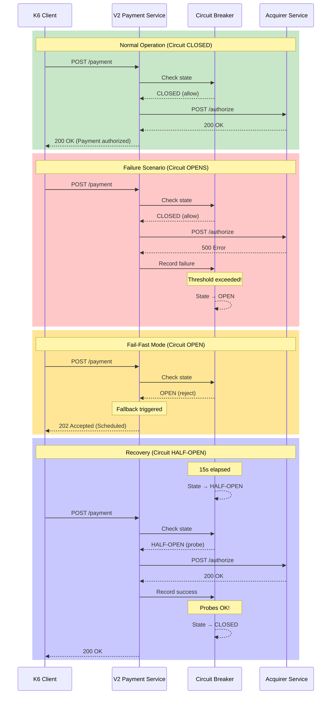

## Sequence Flow Explanation

1. **Normal Operation** (Green): Circuit is CLOSED, requests flow normally
2. **Failure Detection** (Red): Failures recorded, circuit trips to OPEN
3. **Fail-Fast** (Yellow): Immediate fallback, no backend calls
4. **Recovery** (Blue): After wait, probes test if backend recovered
