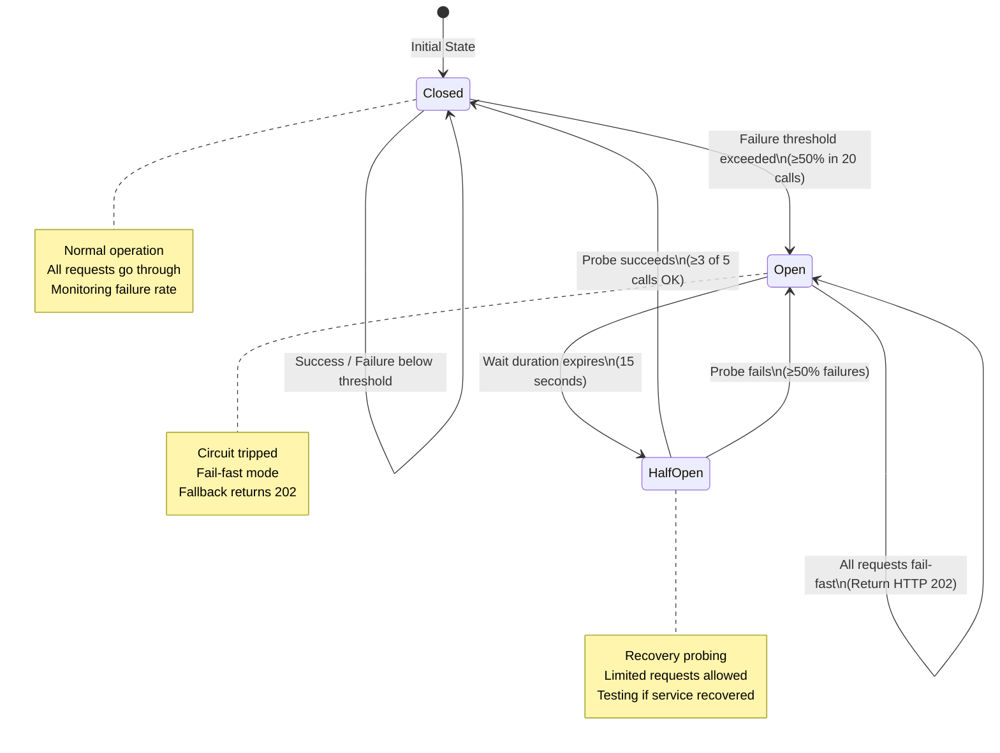

## Circuit Breaker States

| State | Behavior | Duration |
|-------|----------|----------|
| **Closed** | Normal - all requests forwarded | Until failure threshold |
| **Open** | Fail-fast - returns HTTP 202 fallback | 15 seconds |
| **Half-Open** | Probing - 5 test requests allowed | Until success/failure threshold |

## Configuration (V2/V4)
- `failureRateThreshold`: 50%
- `slidingWindowSize`: 20 calls
- `waitDurationInOpenState`: 15s
- `permittedNumberOfCallsInHalfOpenState`: 5
