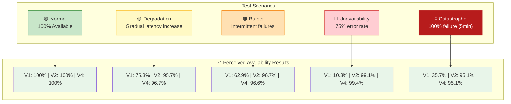

## Scenario Descriptions

| Scenario | Duration | Failure Pattern | Purpose |
|----------|----------|-----------------|---------|
| **Normal** | 13min | None | Baseline validation |
| **Degradation** | 15min | 10%→50% gradual | Progressive stress |
| **Bursts** | 15min | 30s on/off cycles | Intermittent failures |
| **Unavailability** | 15min | 75% constant | High error rate |
| **Catastrophe** | 13min | 100% for 5min | Total outage |

## Key Insight
V4 (Composition) matches V2's protection while absorbing transient jitters through its retry layer.
