```mermaid
flowchart LR
    subgraph V4["V4: Composition Strategy"]
        direction TB
        Request["📥 Incoming Request"]
        Retry["🔄 Retry Layer\n(3 attempts, exp. backoff)"]
        CB["⚡ Circuit Breaker\n(Resilience4j)"]
        Feign["🔗 Feign Client"]
        Acquirer["🏦 Acquirer Service"]
        Fallback["📋 Fallback\n(HTTP 202)"]
    end

    Request --> Retry
    Retry --> CB
    CB -->|"CLOSED"| Feign
    CB -->|"OPEN"| Fallback
    Feign --> Acquirer
    Acquirer -->|"Success"| Feign
    Acquirer -->|"Failure"| Retry
    Retry -->|"Max retries"| CB

    style Request fill:#E3F2FD,stroke:#1976D2
    style Retry fill:#BBDEFB,stroke:#1976D2
    style CB fill:#C8E6C9,stroke:#388E3C
    style Feign fill:#E0E0E0,stroke:#757575
    style Acquirer fill:#F5F5F5,stroke:#9E9E9E
    style Fallback fill:#FFE0B2,stroke:#F57C00
```

## V4 Composition Flow

1. **Request arrives** at Payment Service
2. **Retry layer** wraps the call (absorbs transient failures)
3. **Circuit Breaker** checks state:
   - **CLOSED**: Forward to Feign → Acquirer
   - **OPEN**: Immediate fallback (HTTP 202)
4. **On failure**: Retry attempts before CB records failure
5. **On persistent failure**: CB opens, subsequent calls fail-fast

## Benefits of Composition
- **Jitter absorption**: Transient blips handled by retry
- **Protection**: Persistent failures trigger CB
- **Best of both**: V2's protection + V3's resilience
